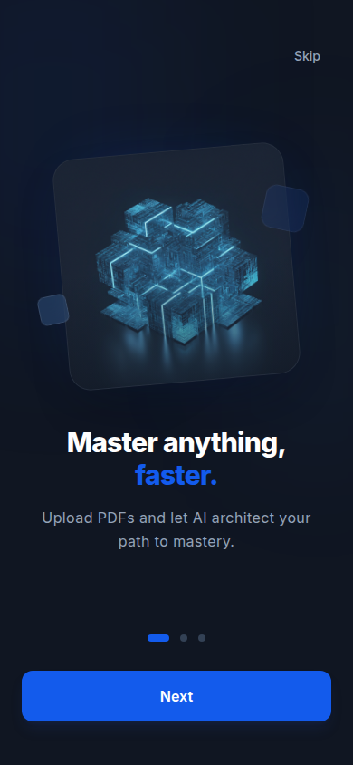
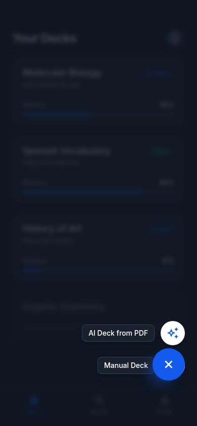
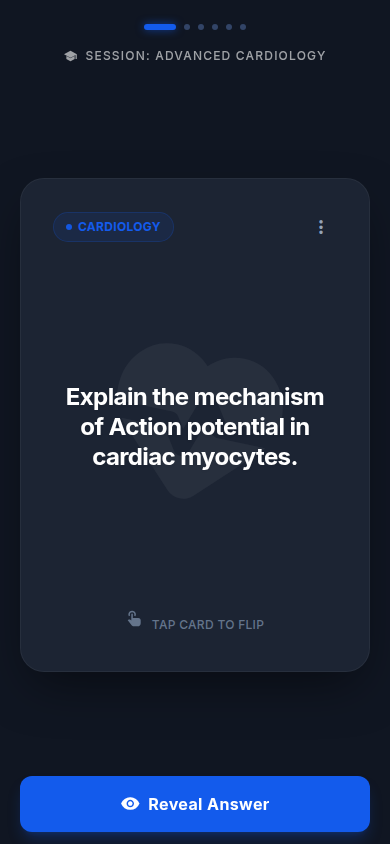
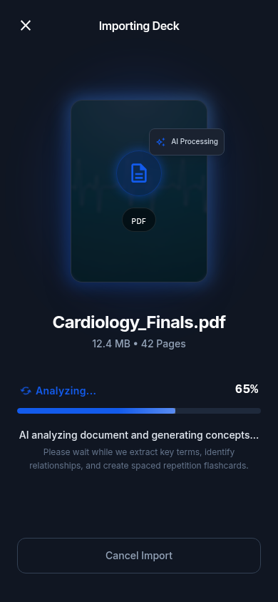
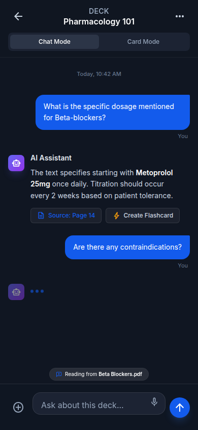

# Memora

**Flashcards com repetição espaçada e um tutor de IA configurável por deck.**

Crie decks, gere cards a partir de texto ou PDF, estude com auto-avaliação, peça insights por card e converse com um agente tutor — tudo no mesmo app. Android, iOS e web.

---

## Baixar

**Site oficial:** [matheusz-nied.github.io/Memora](https://matheusz-nied.github.io/Memora/)

Lá você encontra os links de download, a política de privacidade e suporte.

| Plataforma | Onde baixar |
|---|---|
| **Android** | [GitHub Releases](https://github.com/matheusz-nied/Memora/releases) (APK) · Google Play *(em breve)* |
| **iOS** | App Store *(em breve)* |
| **Web** | Em breve no site |

> Seus decks, cards e histórico de estudo ficam **apenas no seu aparelho**. Não há conta, não há servidor e não há telemetria. A única coisa que sai do aparelho é o texto que você manda para a IA, com a chave da DeepSeek que você cadastrou — direto do celular para lá, sem intermediário.

---

## O que o app faz

- **Decks e cards** — organize o que quer aprender em baralhos com título, descrição e agente tutor próprio.
- **Geração com IA** — cole um texto ou envie um PDF e receba flashcards prontos para revisar antes de salvar.
- **Estudo offline** — repetição espaçada simplificada (Não sei / Difícil / Bom / Fácil), TTS no idioma do deck e sessão completa sem internet.
- **Insights por card** — explicação aprofundada gerada uma vez e guardada para sempre.
- **Chat com o tutor** — pratique inglês, biologia, programação ou qualquer tema com um agente configurável por deck.
- **Backup** — exporte e importe um `.json` para não perder nada se trocar de aparelho.

Para usar geração, chat e insights, cadastre sua chave da [DeepSeek](https://platform.deepseek.com/) no fim do onboarding. Sem ela o app funciona normalmente para criar decks, estudar e fazer backup — só as funções de IA ficam indisponíveis.

---

## Telas

  
  
  
  
  

---

## Como foi construído

Resumo técnico para quem quiser entender o projeto antes de abrir o código.

**Flutter** em três plataformas (Android, iOS, web), com **Riverpod** para estado, **go_router** para navegação e **Drift** como banco local offline-first — toda escrita vai primeiro para o aparelho.

A IA roda via **DeepSeek** com a chave do próprio usuário; nada passa por servidor nosso. PDFs são lidos no dispositivo; o chat e os insights também saem direto do app para a API.

O backend remoto (Supabase — auth, sync, Edge Functions) já está implementado atrás de contratos internos, mas **o v1 publicado é 100% local**: sem conta, sem sync, sem quota. Trocar para o modo nuvem é recompilar com outra constante — o adaptador já existe no repositório, reservado para uma versão futura.

Design system próprio (`AppColors`, `AppTypography`, `AppDimensions`), textos centralizados por feature, CI com testes e análise estática. Código aberto sob licença MIT.

Detalhes de arquitetura, schema do banco e regras de contribuição: [`AGENTS.md`](AGENTS.md).

---

## Privacidade e suporte

- [Política de Privacidade](https://matheusz-nied.github.io/Memora/politica-de-privacidade)
- Dúvidas, erros e sugestões: [issues no GitHub](https://github.com/matheusz-nied/Memora/issues) ou matheusz.nied@gmail.com

---

## Licença

O código do Memora está sob a licença [MIT](LICENSE).

**Ressalva:** a dependência `syncfusion_flutter_pdf` (extração de texto de PDF) **não é open source**. Exige a [Community License da Syncfusion](https://www.syncfusion.com/sales/communitylicense) (gratuita, com registro) ou licença comercial. A MIT deste repositório cobre o código escrito aqui, não as dependências de terceiros.

Os mockups em `memora_view_design/` são referência visual gerada no Stitch e não fazem parte do software licenciado acima.
